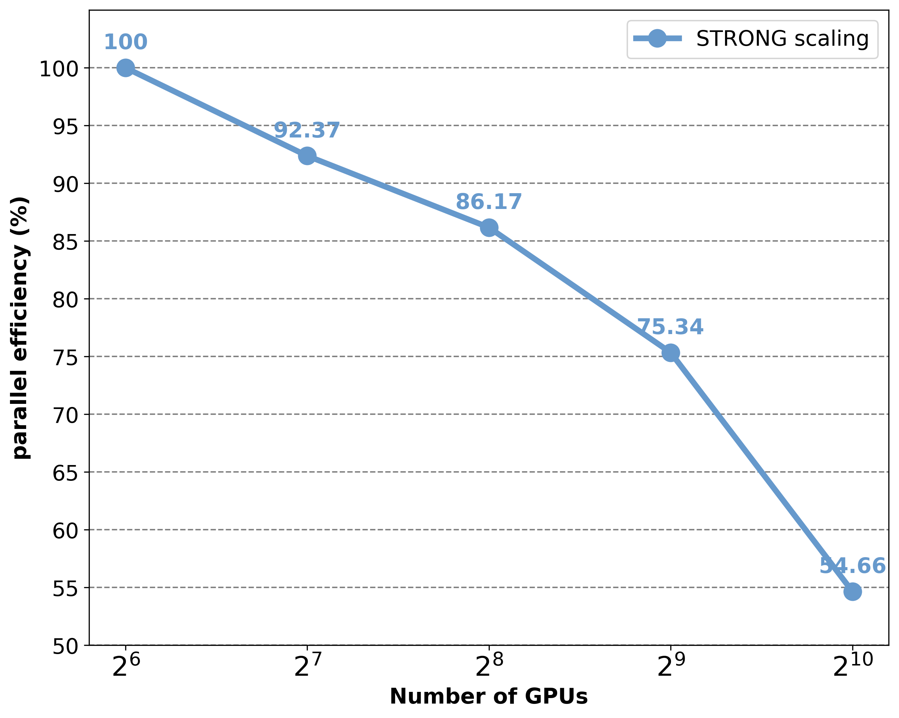

# WindStencil: Unleashing GPU Potential for High-Order Stencil Computation in High-Performance Inviscid CFD Simulations

[](https://kernel.org/)
[](https://rocm.docs.amd.com/)
[](https://www.open-mpi.org/)
[]()
[]()
[](https://github.com/BabyXPrince/WindStencil)
[](README.md#citation)
[](docs/README.md)

**WindStencil** is a GPU architecture and implementation methodology for **high-order (e.g. 7th-order) three-dimensional WENO** stencils inside **production-style compressible Navier–Stokes** solvers. Generic stencil optimizations rarely survive the full **split-form inviscid flux + multi-variable 3D templates + face/center alignment** found in real CFD codes; this repository is the **reference implementation** of the techniques described in the paper—**block-fused 3D WENO (BF3W)**, **yz-plane scanning** to match SIMT execution to the stencil’s geometry, and **multi-level software prefetching** to hide memory latency behind the kernel’s large FP64 arithmetic intensity.

The code is organized around a **full solver stack** (time integration, boundaries, I/O, MPI) so results reflect **end-to-end** behavior, not an isolated micro-benchmark. The implementation targets **AMD GPUs via HIP/ROCm**; **OpenCFD-SC** lineage appears in file headers and provides the surrounding solver context.

**Where the novel kernels live:** **`src/kernels/OCFD_split.cpp`** (fused path, scan + prefetch). Supporting WENO machinery: **`src/kernels/OCFD_Schemes.cpp`**, **`src/kernels/commen_kernel.cpp`**.

---

## Technical contributions (code-level)

- **BF3W — block-fused 3D WENO** — Fuses the inviscid pipeline that is typically split across **nine** separate kernels in a decomposed implementation; keeps hot intermediates in registers / LDS and removes redundant round-trips through global memory for flux/WENO intermediates.
- **Plane scanning** — `scanY` / `scanZ` sub-window progression over the \(yz\) plane so thread blocks **reuse faces** and better align **cell-centered** and **face-centered** work with SIMT execution (see `OCFD_split.cpp`).
- **Prefetching** — **Software double-buffering** and explicit prefetch of upcoming global / shared data in the fused WENO loop, overlapping long-latency loads with the **very large FP64** operation count per 3D25P update. Inspect generated ISA for load patterns (e.g. global load vectorization) on your toolchain.
- **Multi-GPU** — MPI domain decomposition with device-aware halo exchange (`src/mpi/` and related modules), supporting weak and strong scaling studies.

For a **map from repository layout to the paper’s sections**, see **`docs/ARCHITECTURE.md`**. For **other vendors and WENO orders**, see **`docs/PORTING.md`**. All documentation is indexed in **[`docs/README.md`](docs/README.md)**.

---

## Reported performance (paper evaluation)

*The following figures summarize results reported with the **WindStencil** paper (ICS 2026 cycle). Grids, case setup, and toolchain match the manuscript; reproduce on your cluster before citing raw speedups.*

### Single-GPU efficiency and kernel speedup

| Platform | FP64 % of peak (paper) | Kernel speedup vs. decomposed OpenCFD baseline (paper) |
|----------|-------------------------|--------------------------------------------------------|
| AMD MI60 | **37.2%** (up to ~37.2% on listed grids) | **~424%** (i.e. ~4.24× faster kernel time) |
| AMD MI200 family | **~30.8%** of architectural FP64 peak (configuration-dependent) | **~468%** (i.e. ~4.68× faster kernel time) |

**Roofline / bandwidth narrative.** The stencil is still **memory-sensitive** on a roofline chart; we therefore also report performance relative to an **attainable roof** at the kernel’s **operational intensity** (O.I., FLOP/byte moved). On MI200-class hardware, reported **attainable-roof** utilization reaches on the order of **51%** on representative grids (see paper tables for O.I. per grid).

### End-to-end speedup (1000 iterations, full application)

Speedups below are **wall-clock** of the whole program vs. the same **unoptimized OpenCFD** path, on the grids used in the paper (percent = improvement over baseline; e.g. 161% ≈ **1.61×** faster end-to-end).

**MI60**

| Grid | Kernel-focused gain | Full-application gain |
|------|---------------------|------------------------|
| 480×64×32 | 410.55% | 161.24% |
| 480×128×64 | 398.37% | 181.00% |
| 480×128×128 | 423.57% | 198.69% |
| 480×192×128 | 456.80% | 217.24% |
| 480×512×64 | 485.52% | 215.29% |

**MI200 family**

| Grid | Kernel-focused gain | Full-application gain |
|------|---------------------|------------------------|
| 600×64×32 | 461.76% | 163.18% |
| 600×64×128 | 406.67% | 179.48% |
| 600×128×128 | 468.08% | 189.83% |
| 600×192×128 | 363.51% | 188.14% |
| 600×256×128 | 420.38% | 188.94% |

*Inviscid work optimized by WindStencil accounts for a large fraction of total runtime in the evaluated configuration (see paper §4.1); remaining phases limit end-to-end multiples.*

### Scalability

- **Weak scaling:** reported parallel efficiency **~91.16%** at **1024 GPUs** (paper configuration).


- **Strong scaling** (fixed **600M** cells, 9600×256×256, MI200 cluster):

| GPUs | 64 | 128 | 256 | 512 | 1024 |
|------|-----|-----|-----|-----|------|
| Efficiency (vs. 64-GPU baseline) | 100% | 92.37% | 86.17% | 75.34% | 54.66% |




### Numerical correctness

After **10,000** steps, maximum **relative** differences vs. the baseline implementation on monitored global quantities:

- **Total energy:** **1.12×10⁻⁵**
- **Total temperature:** **4.16×10⁻⁵**

Add automated checks under `tests/` when you publish a reproducible artifact (optional).

---

## Metrics, baselines, and scope

The evaluation reports **fraction of FP64 peak** together with **attainable-roofline** utilization at the measured **operational intensity** (FLOP per byte moved). That pairing matters because a 7th-order 3D WENO update carries far more arithmetic than a minimal stencil; the manuscript tabulates O.I. and bandwidth-related views alongside peak-oriented numbers.

**Speedups** in this repository’s narrative are anchored in **one codebase and one machine class**: the decomposed inviscid-kernel path versus the WindStencil path inside the same application stack. Any comparison that draws in **other publications or different hardware** is **contextual**—useful for positioning, not a substitute for same-stack measurements.

**Scaling** results include both **weak** scaling (problem size grows with GPU count) and **strong** scaling (fixed global mesh, more GPUs). They answer different questions: sustained throughput at scale versus time-to-solution when partitioning a fixed discretization—the latter stresses halo traffic and balance.

Memory latency in the fused kernel is addressed through **software pipelining**—double buffering and staged loads visible in **`src/kernels/OCFD_split.cpp`**—rather than opaque runtime behavior.

**Portability** of the ideas (fusion, plane scan, prefetch) is discussed in **`docs/PORTING.md`**, together with notes on **5th- / 9th-order** WENO (halo depth, sub-window geometry, on-chip budget).

---

## Repository layout

| Path | Role |
|------|------|
| `include/windstencil/` | All project headers (single include root: `-I include/windstencil`). Sources use `#include "name.h"`. |
| `src/kernels/` | Fused WENO path (`OCFD_split.cpp`), schemes, HIP runtime glue (`cuda_commen.c`, `cuda_utility.c`). |
| `src/solver/` | Time integration, NS / Jacobian drivers, flux and scheme selection, `OCFD_Stream`. |
| `src/boundary/` | Boundary conditions and boundary schemes. |
| `src/io/` | File I/O and MPI-I/O helpers. |
| `src/mpi/` | Host and device MPI support. |
| `src/runtime/` | Parameters, utilities, initialization, filtering, diagnostics, tests. |
| `src/app/` | Program entry: `opencfd_hip.c` (built), `opencfd.c` (CUDA-style source for hipify). |
| `docs/` | Documentation index [`docs/README.md`](docs/README.md), [`ARCHITECTURE.md`](docs/ARCHITECTURE.md), [`PORTING.md`](docs/PORTING.md), figures in [`docs/images/`](docs/images/). |

*Tuning for MI60 vs. MI200 in this tree is handled via **architecture flags** (`GPU_ARCH`) and compiler options rather than duplicate source files.*

---

## Requirements

- **Linux** (typical HPC environment)
- **AMD ROCm** with **`hipcc`**
- **MPI** (e.g. Open MPI / HPC-X), development headers and libraries
- GPU architecture flag compatible with your hardware (e.g. `gfx906` for MI60 class, `gfx90a` for MI200 class, `gfx942` where applicable)
- **Paper software stack (reference):** ROCm **6.1**, **Clang 17.0.0**, **Open MPI 5.0.3**, **InfiniBand** interconnect on the large-scale runs; align versions when reproducing published scaling numbers.

---

## Build

Set paths and architecture, then build:

```bash
export ROCM_PATH=/opt/rocm
export MPI_PATH=/path/to/mpi
export GPU_ARCH=gfx906    # e.g. gfx90a for MI200 class

make -j
```

This produces the executable **`opencfd-windstencil`** (override with `make TARGET=myname`). The default `makefile` uses **`-O2`**; match the paper’s flags if you need bit-for-bit performance parity.

### Makefile variables

| Variable | Default | Purpose |
|----------|---------|---------|
| `HIPCC` | `hipcc` | HIP compiler / linker driver |
| `MPICXX` | `mpicxx` | Host C compiler for plain MPI `.c` units |
| `ROCM_PATH` | `/opt/rocm` | ROCm install prefix |
| `MPI_PATH` | *(cluster-specific)* | MPI prefix for `-I` / `-L` |
| `GPU_ARCH` | `gfx906` | `-mcpu=` for device code |
| `TARGET` | `opencfd-windstencil` | Output binary name |

Other targets:

```bash
make help          # short usage
make clean         # remove binary and obj/
make hipify-main   # regenerate src/app/opencfd_hip.c from src/app/opencfd.c (needs hipify-perl)
```

---

## Entry point and hipify

- **What you compile:** `src/app/opencfd_hip.c` (HIP entry).
- **Canonical CUDA-era source:** `src/app/opencfd.c`. If you change it, run:

  ```bash
  make hipify-main
  ```

  then rebuild. This requires **`hipify-perl`** from ROCm.

---

## Running

The solver expects runtime configuration consistent with OpenCFD-SC (e.g. parameter file **`opencfd-scu.in`** in the working directory). See `src/runtime/parameters.c` for file names and parsing. Consult your case setup and institute documentation for grid and boundary inputs.

```bash
mpirun -np <ranks> ./opencfd-windstencil
```

---

## Profiling artifacts (optional)

For transparency on **stall cycles**, cache behavior, and prefetch effectiveness, you may add a top-level **`profiling/`** directory with **ROCprofiler** (or equivalent) summaries or anonymized traces, subject to cluster policy. This directly supports hardware-level questions in review and replication.

---

## Citation

Please cite the **WindStencil** paper as the **primary** reference (e.g. ICS 2026, once public). Also acknowledge **OpenCFD-SC** authors and per-file copyright notices (e.g. `src/app/opencfd.c`). Add **`CITATION.cff`** after bibliographic data is final.

---

## License and upstream

Copyright and authorship notices appear in individual source files. **Add a top-level `LICENSE` file** that matches your institution’s policy before redistributing; this repository does not ship a license file by default.

---

## Contributing

Issues and pull requests are welcome for build fixes, portability (ROCm versions, GPU targets), documentation, and optional **`tests/`** / **`profiling/`** content. Large kernel refactors should preserve numerical behavior and include regression checks against a known baseline.

---

## Contact

[zhangxinxin@cnic.cn](mailto:zhangxinxin@cnic.cn)
